# Understanding Swift Performance

Swift의 추상화 매커니즘이 성능에 미치는 영향을 이해하는 가장 좋은 방법은 기본 구현을 이해하는 것이다. 따라서 이 세션에서는 추상화 매커니즘을 선택할 때 고려해야할 사항들에 대해 이야기 한다.

## Dimensions of Performance
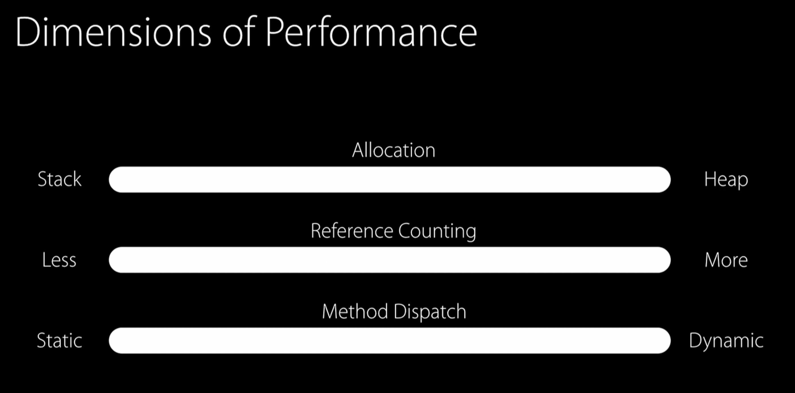

추상화를 구축하고 추상화 매커니즘을 선택할때 고려해야할 사항이다.
* **`Allocation`**: 인스턴스가 스택 or 힙에 할당될지?
* **`Reference Counting`**: 인스턴스를 전달할 때 얼마나 많은 reference counting 오버헤드가 발생하는지?
* **`Method dispatch`**: 이 인스턴스에서 메소드를 호출할때 정적 or 동적 dispatch 되는지?

## Allocation
Swift는 자동으로 메모리를 할당하고 해제한다. Stack, Heap 어디에 할당되느냐에 따라 어떠한 성능 차이가 있는지에 대해 알아보자.

### Stack
스택은 간단한 자료구조로 스택의 끝에서 push하고 pop 할 수 있다. 따라서 스택에 메모리를 할당할때, 스택 포인터(스택 끝에 있는 포인터)를 약간만 줄여 공간을 확보함으로써 필요한 메모리를 할당할 수 있다. 또한 함수의 실행이 끝나면 스택 포인터를 함수 호출하기 전의 위치로 다시 증가시켜 간단하게 메모리 할당을 해제할 수 있다. 따라서 스택 할당은 매우 빠르다.

### Heap
스택과 달리, 힙은 동적이지만 효율성이 떨어진다. 힙에 메모리 공간을 할당하려면 적절한 크기의 사용되지 않은 공간을 찾아야한다. 또한 멀티 스레드가 동시에 힙에 메모리를 할당할 수 있으므로 힙은 lock이나 다른 동기화 메커니즘을 통해 무결성을 보장해야한다. 이것은 스택에 비해 많은 비용이 든다.  

예시를 살펴보자.  
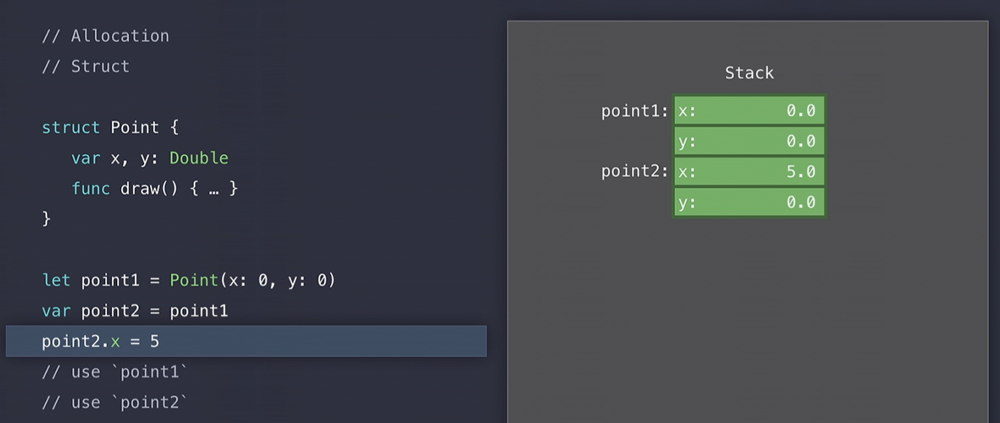 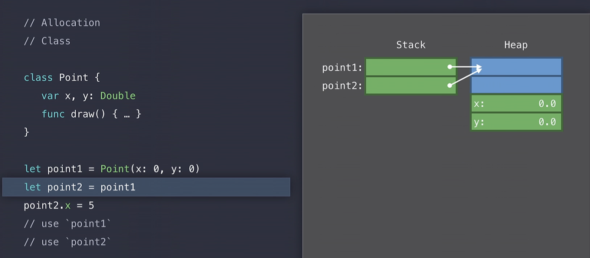  
* struct 이용 시, 코드를 실행 하기 전에 point1과 point2 인스턴스를 위해 스택에 공간을 할당하고 이를 구성 시에 이미 할당된 메모리를 초기화하기만 하면 된다.  
또한 point1에 point2를 할당할때 point의 복사본을 만들고 우리가 이미 스택에 할당했던 point2 메모리를 초기화한다. 따라서 point1, point2는 독립적인 인스턴스이다. 이것을 value semantic이라고 한다.
* class 이용 시, struct와 마찬가지로 스택에 메모리를 할당한다. 그러나 point 프로퍼티에 값을 저장하는 것이 아닌, point1과 point2에 대한 참조 메모리를 할당하는 것이다. point 인스턴스를 구성할때 Swift는 힙을 lock하고 적절한 크기의 사용되지 않은 메모리 공간을 검색하고 메모리를 초기화한다. point1은 해당 메모리 주소를 참조한다. 
또한 point1을 point2에 할당할 때 struct와 달리 참조를 복사한다. 따라서 point1과 point2는 실제로 힙에 있는 동일한 인스턴스를 참조한다. 이것을 reference semantic이라고 하며 의도하지 않은 상태 공유로 이어질 수 있기에 사용 시 주의해야한다.

따라서 클래스는 힙에 할당되고 reference semantic 체계를 가지기 때문에 ID 및 간접 저장소와 같은 몇 가지 강력한 특성이 있다. 하지만 추상화를 위해 이러한 특성이 필요하지 않는다면, 클래스보다 적은 비용이 드는 구조체를 사용하는 것이 더 좋다. 또한 구조체는 클래스처럼 의도하지 않은 상태의 공유에 취약하지 않다.  

## Reference Counting
Swift는 힙에 할당된 메모리를 언제 할당 해제하는 것이 안전한지 어떻게 알까? 즉, 해당 객체를 누가 참조 하지 않는 것에 대해 어떻게 알까?  
대답은 Swift가 힙의 모든 인스턴스에 대한 총 참조 수(reference count)를 유지한다는 것이다. 그리고 인스턴스 자체에 유지한다. 참조를 추가하거나 참조를 제거하면 해당 참조 카운트가 증가하거나 감소한다. 그 수가 0에 도달하면 Swift는 아무도 더 이상 힙의 이 인스턴스를 가리키지 않는다는 것을 알고 해당 메모리를 할당 해제하는 것이 안전하다는 것을 알게 된다.

인스턴스는 reference count를 스스로 가지고 있다고 했다. Swift에서는 이를 atomically하게 증가시키고 감소 시켜야한다.(무결성 보장) 이러한 reference count를 atomically하게 관리하는 방식에 대해 알아보자.

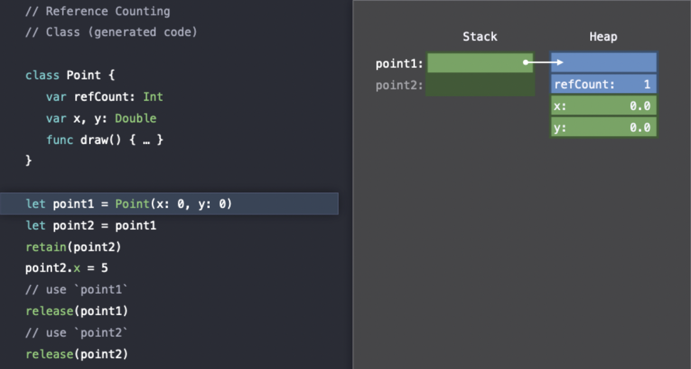  

point1 객체가 생성될 때, 힙에 Point를 구성한 후 해당 Point에 대한 하나의 살아있는 참조가 있기 때문에 1의 참조 카운트로 초기화 된다는 것을 알 수 있다. 그리고 point2에 point1을 할당하면 이제 두 개의 참조가 있으므로 Swift는 Point인스턴스의 참조 횟수를 atomically하게 증가 시키는 호출 코드(retain)를 추가한다.  
계속 실행하면서 point1 사용이 끝나면 Swift는 참조 횟수를 atomically하게 감소시키는 호출(release)을 추가한다. 마찬가지로 point2 사용이 끝나면 Swift는 release를 통해 참조 카운트의 atomically한 감소를 추가한다.

예시를 통해, class는 refCount 라는 property를 생성하고 retain() 메소드를 통해 atomically하게 refCount 증가시켜 주고 release() 메소드를 통해 atomically하게 refCount 감소시켜준다는 것을 알 수 있다.  

struct는 힙 할당이 일어나지 않기 때문에 이것에 관련한 참조는 없다. 따라서 구조체에 대한 참조 카운팅 오버헤드는 존재하지 않는다.  

## Method Dispatch
런타임에 메서드를 호출할 때 Swift는 올바른 구현을 실행해야한다. Method dispatch에는 Static dispatch 와 Dynamic dispatch 가 있다.

### static dispatch
컴파일 타임에 실행할 구현을 결정할 수 있다면, 이는 static dispatch이다. 
이것은 실제 런타임에 올바른 구현으로 바로 이동이 가능하며 컴파일러가 실제 어떠한 구현이 실행될 것인지에 대해 가시성을 가지기 때문에 inline과 같은 것을 포함하여 코드의 최적화를 가능하게 한다.

### dynamic dispatch
static dispatch와 대조적인 dynamic dispatch는 컴파일 타임에 실행할 구현을 결정할 수 없으며, 그 결과 런타임에 어떠한 구현을 실행할 것인지 찾고 이동한다.  
이 경우 앞서 static dispatch에서 컴파일러가 가진 가시성을 차단하고 코드의 최적화를 불가능하게 만든다.  

그렇다면 왜 우리는 dynamic dispatch를 가지고 있을까?
그 이유 중 하나는 다형성에 있다.  

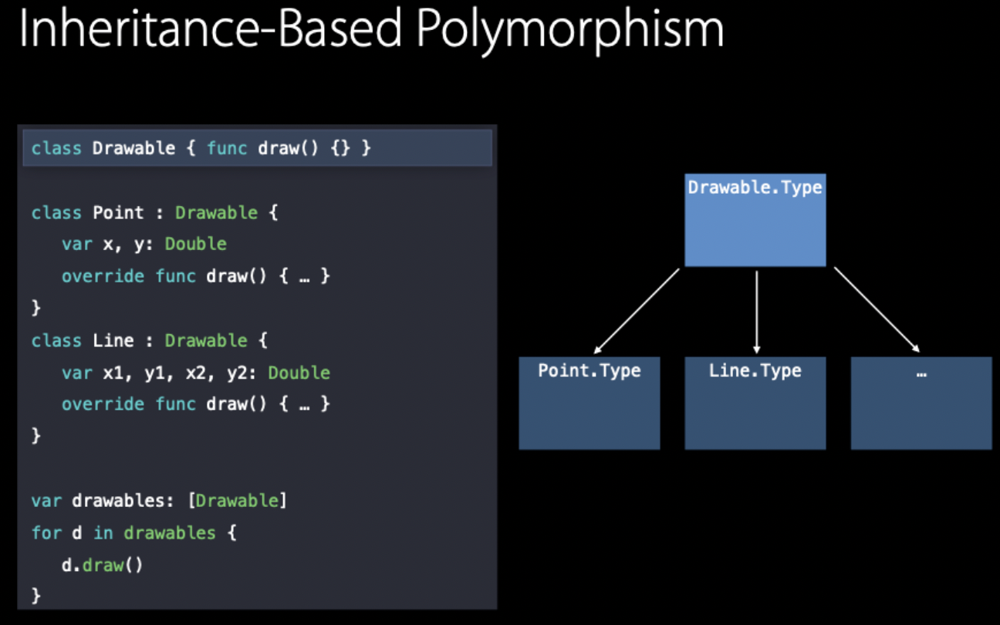  

Drawable이라는 추상 super class가 있고, 이를 상속받아 draw를 재정의하는 Point, Line이라는 하위 클래스가 있다. drawables라는 Drawable 배열을 선언해놓았다. 이 배열은 Drawable을 상속한 lines, points를 가질 수 있고, 이때 각각의 원소들은 draw()라는 메소드를 호출할 수 있다. 이것이 가능한 이유는 바로 Drawable, Line, Point는 모두 다 class이고 따라서 이들은 모두 다 같은 크기로 참조 형태로 배열에 저장이 되기 때문이다.

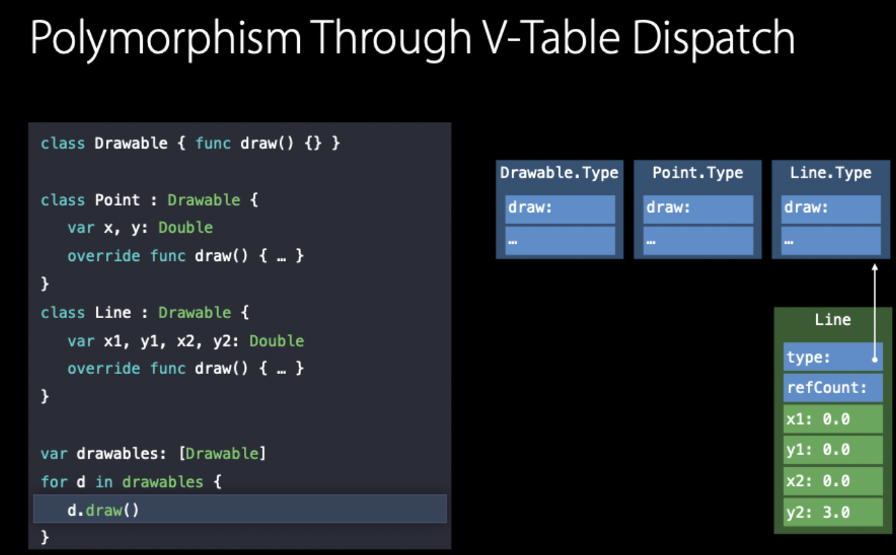

코드에서 for문을 drawables 개수만큼 반복하면서 인스턴스에 대해서 draw()함수를 호출할때, 컴파일러는 컴파일 타임에 정확히 어떠한 구현을 실행해야 하는지 알 수 없다. d.draw()는 Line의 draw()가 될 수도 있고 Point의 draw()가 될 수도 있기 때문이다.

따라서 컴파일러는 어떤 draw를 호출해야하는지 결정하기 위해, class의 type에 대한 포인터를 정적(static)메모리에 저장하게 된다.  
draw가 호출되었을 때, 컴파일러는 실행할 올바른 구현을 찾기 위해 정적(static) 메모리의 VTable(Virtual Method Table)라는 것을 조회한다.
VTable 안에는 어떠한 구현을 실행해야 하는지에 대한 pointer를 저장하고 있기 때문에 실행할 draw 메서드를 찾고 실제 인스턴스를 암시적 self 매개변수로 전달한다.

예시를 통해, Swift에서 class는 기본적으로 dynamic dispatch를 하게 된다. 물론 이러한 dynamic dispatch만으로 큰 차이를 만들지는 않지만 메서드 체인 및 기타 사항과 관련하여 인라인과 같은 최적화를 방지 할 수 있고 합산될 수 있다.  
하지만 모든 class에 dynamic dispatch가 필요한 것은 아니다. 상속될 가능성이 없는 class의 경우에는 final 키워드를 클래스 명 앞에 붙여준다. 컴파일러는 이를 알아차리고 해당 메서드를 정적으로 dispatch를 하게 될 것이다. 또한 compiler가 application에서 class가 상속이 이뤄지지 않는다는 것을 추론하고 증명할 수 있다면 기회에 따라, 이러한 dynamic dispatch를 사용자 대신 static dispatch로 전환한다.

## 전반부 결론  
* 이 인스턴스가 스택에 할당될 것인지 힙에 할당될지
* 이 인스턴스를 전달할 때 얼마나 많은 reference counting 오버헤드가 발생하는지
* 이 인스턴스에서 메소드를 호출하면 정적으로 dispatch 되는지 동적 dispatch 되는지  

이 세션의 전반부에서 자기 자신에게 던져야 하는 질문들이다. Swift 코드를 읽고 작성할 때마다 다음과 같은 질문들을 스스로 생각해야한다.

Swift를 처음 사용하거나 Objective C 에서 Swift 로 이식된 코드 기반에서 작업 하는 경우 구조체를 더 많이 활용할 수 있다.  

그러나 구조체를 사용하여 다형성 코드를 작성 하는 방법은 무엇일까? 라는 질문이 남아있다.  

답은 **프로토콜 지향 프로그래밍** 이다.

## 프로토콜 지향 프로그래밍
### Protocol Type
이번에는 프로토콜 타입을 사용하여 구현한 애플리케이션으로 돌아가 보자.

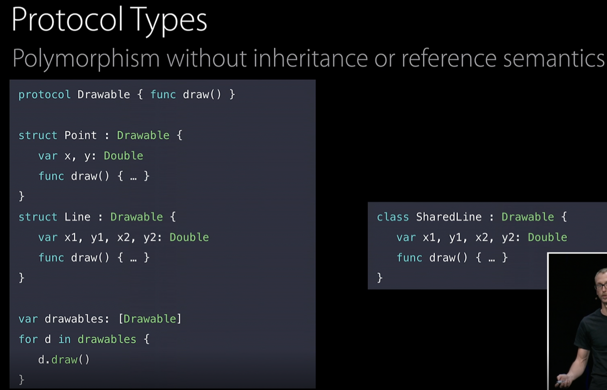

Drawable 추상 super class 대신 이제 draw 메서드를 선언한 프로토콜 Drawable이 있다.
그리고 프로토콜을 준수하는 값 타입 구조체 Point와 Line이 있다. 프로토콜을 준수하는 SharedLine 클래스를 가질 수도 있다. (그러나 클래스와 함께 제공되는 reference semantic은 의도하지 않은 공유로 인해 예시에서 제외)  
프로토콜 타입을 사용한 이 프로그램은 여전히 다형성을 가지고 있다. Drawable 타입 배열에 Point 타입과 Line 타입의 값을 모두 저장할 수 있다.  

그러나 이전과 비교하면 한 가지가 달라졌다.

Line, Point는 값 유형이기 때문에 이전에 본 메커니즘인 V-Table 디스패치를 수행하는 데 필요한 공통 상속 관계를 공유하지 않는다. 그렇다면 Swift는 어떻게 올바른 메서드로 디스패치할까?  

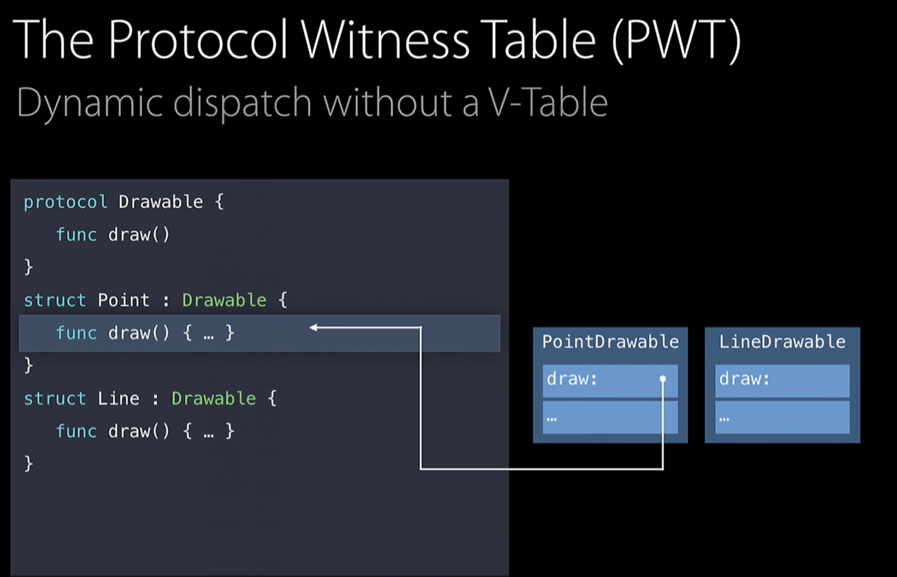

이 질문에 대한 답은 Protocol Witness Table 이라는 테이블 기반 메커니즘이다. 애플리케이션에서 프로토콜을 구현하는 타입당 이러한 테이블 하나를 가진다. 그리고 해당 테이블의 항목은 타입 구현에 연결된다. 이제 우리는 해당 메서드를 찾는 방법을 알게 되었다.

그러나 여전히 배열의 요소에서 테이블로 이동하는 방법에 대한 의문이 남는다.  
그리고 어떻게 값들을 일괄적으로 저장되는 지에 대한 의문이 남는다.

### 일괄적으로 저장하는 방법
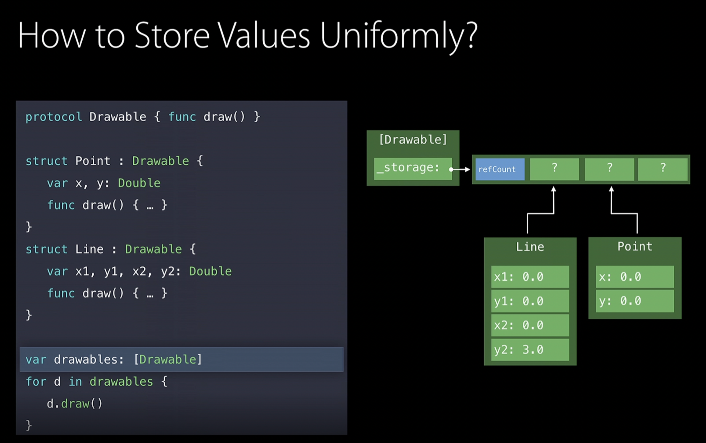

Line은 4개의 단어가 필요하고 Point는 2개의 단어가 필요하다.
그들은 같은 크기를 가지고 있지 않다. 그러나 우리 배열은 배열의 고정 오프셋에 요소를 균일하게 저장하려고 한다. 어떻게 작동할까?  

이 질문에 대한 답은 Swift가 Existential Container 라는 특별한 스토리지 레이아웃을 사용한다는 것이다.  
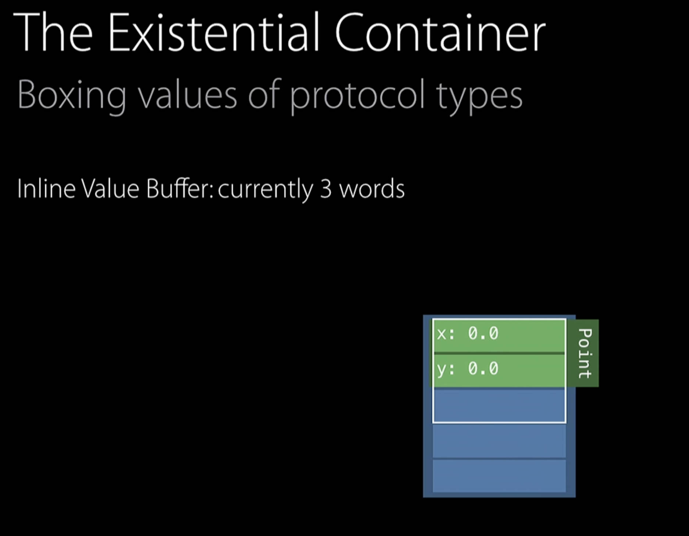 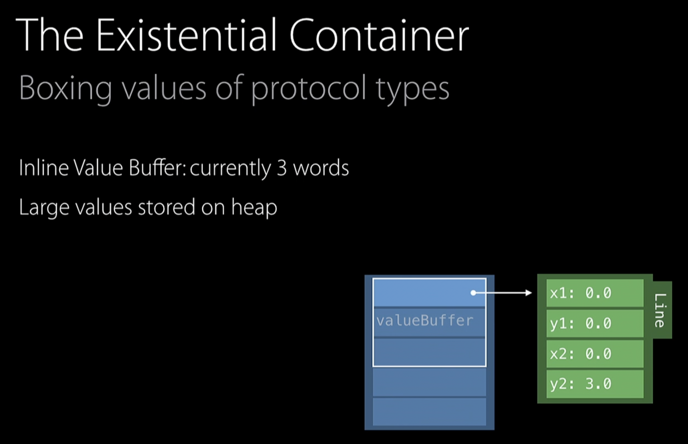  
Existential Container의 처음 세 단어는 valueBuffer용으로 예약되어 있다. 두 단어만 필요한 Point와 같은 작은 타입은 이 valueBuffer에 맞는다. 그러면 네 단어가 필요한 Line은 어디에 둘까? 이 경우 Swift는 힙에 메모리를 할당하고 거기에 값을 저장한 뒤 Existential Container에 해당 메모리에 대한 포인터를 저장한다. 따라서 Existential Container는 이 차이를 관리해야 한다. 이 차이를 관리하는 방식은 다시 테이블 기반 메커니즘이다.

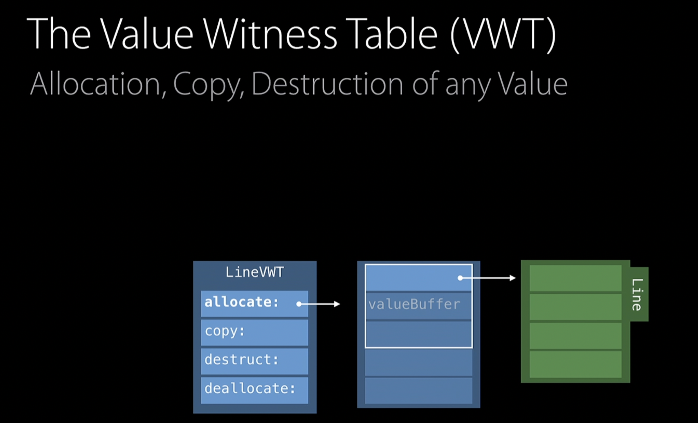

그것을 Value Witness Table이라고 부른다.
Value Witness Table은 value 수명을 관리하며 프로그램의 타입별로 이러한 테이블 중 하나를 가진다. 로컬 변수의 수명을 살펴보고 이 테이블이 어떻게 작동하는지 살펴보자. 프로토콜 타입의 로컬 변수의 수명이 시작될 때 Swift는 해당 테이블 내에서 assign() 함수를 호출 한다.  
이 함수는 이제 Line Value Witness Table이 있으므로 힙에 메모리를 할당 하고 Existential Container의 valueBuffer 내부 에 해당 메모리에 대한 포인터를 저장한다. 다음으로, Swift는 로컬 변수를 Existential Container로 초기화하는 할당 소스(source of assignment)의 값을 복사해야 한다. Value Witness Table의 복사 항목은 올바른 작업을 수행하고 이를 힙에 할당된 valueBuffer에 복사한다.
 

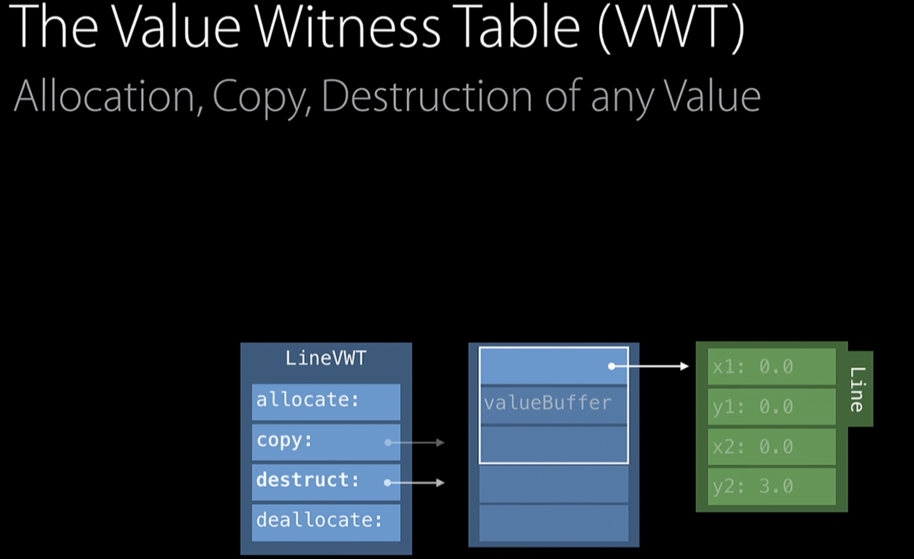 

프로그램이 계속되고 로컬 변수의 수명이 다한다면, Swift 는 Value Witness Table에서 destruct 항목을 호출하여 타입에 포함될 수 있는 값에 대한 참조 카운트를 감소시킨다. 그리고 마지막으로 Swift는 해당 테이블에서 할당 해제 함수를 호출한다.  
다시 말하지만, 우리는 Line에 대한 Value Witness Table을 가지고 있으므로 이것은 우리 값에 대해 힙에 할당된 메모리를 할당 해제할 것이다.  

우리는 Swift가 다른 종류의 값을 일괄적으로 처리할 수 있는 방법에 대한 메커니즘을 보았다.

### 테이블로 이동하는 방법
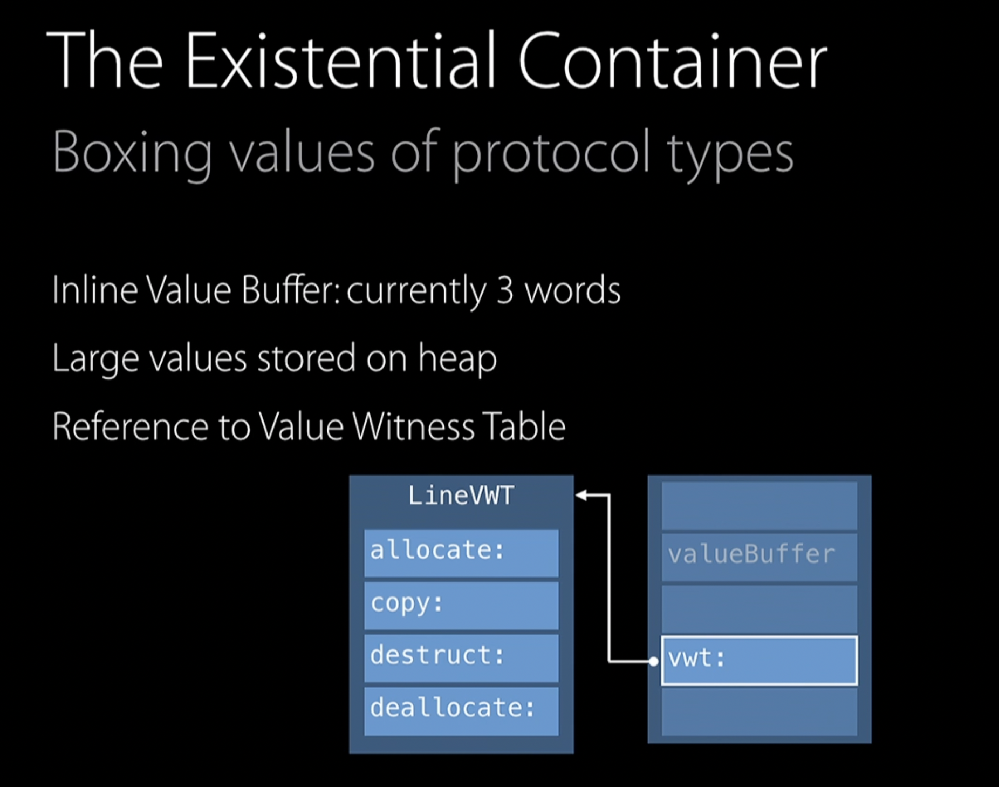 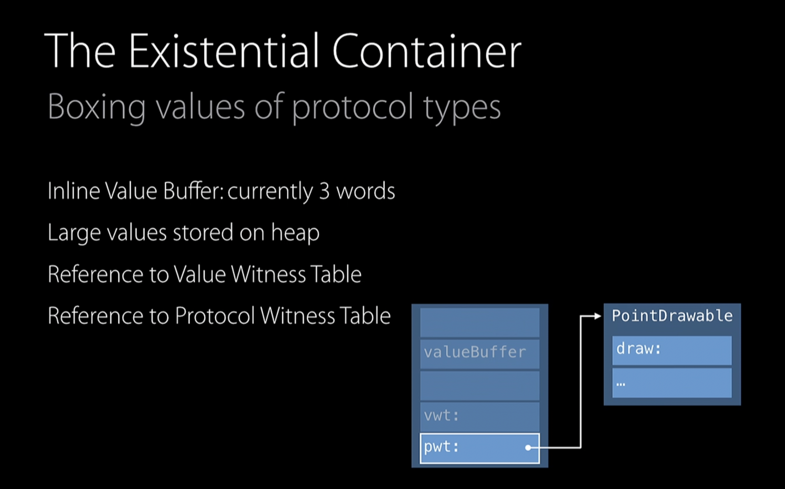  
Existential Container에는 Value Witness Table에 대한 참조 가 있다. 마지막으로 Protocol Witness Table에 도달하는 방법은 무엇일까? 이것은 다시 Existential Container에서 참조된다.

지금까지 Swift가 프로토콜 타입의 값을 관리하는 방법의 메커니즘을 살펴봤다.  

프로토콜을 통해 코드를 작성했을 때 성능에 얼마나 영향을 끼치는지 살펴보자. 
기존의 Container의 valueBuffer에 들어갈 수 있는 작은 값을 포함하는 프로토콜 타입이 있는 경우, 힙 할당이 없다. 구조체에는 참조가 포함되어 있지 않으면 reference count도 없다. 따라서 이것은 정말 빠른 코드이다.  
또한 Value Witness Table을 통한 간접 지정으로 인해 다형성을 허용하는 동적 디스패치의 모든 기능을 얻을 수 있다.  

요약하자면 프로토콜 타입은 동적 형태의 다형성을 제공한다.
프로토콜과 함께 값 타입을 사용할 수 있으며 프로토콜 타입의 배열 내부에 Line과 Point를 저장할 수 있다. 이것은 protocol 및 value witness table과 existential container를 사용하여 달성된다. 큰 값을 복사하면 힙 할당이 발생한다. 그러나 간접 저장 및 Copy on Write로 구조체를 구현하여 이 문제를 해결 하는 방법이 존재한다.  
  

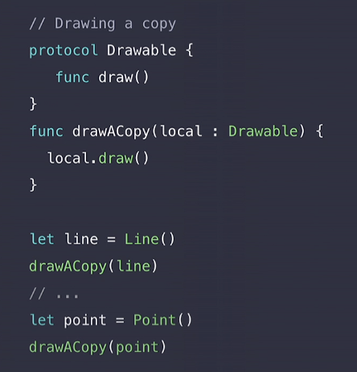 

예시 코드로 돌아가서 다시 살펴보자.
함수에서 Drawable 프로토콜 타입의 매개변수를 복사해야 했다. 그러나 우리가 사용하는 방식은 항상 구체적인 타입에서 사용하는 것이다.
Line으로 사용하고 나중에 프로그램에서는 Point에서 쓸 수도 있다.

여기서 Generic 코드를 사용할 수 있을까?

## Generic Code
이 세션의 마지막 부분에서 제네릭 타입의 변수가 저장되고 복사되는 방법과 메서드 디스패치가 이러한 변수와 함께 작동하는 방법을 살펴볼 것이다.

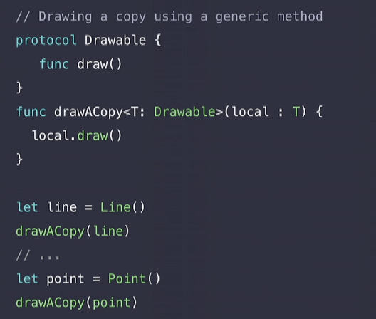 

이제 drawACopy 메서드는 매개변수 제약조건을 Drawable이라는 Generic으로 사용하고 나머지 부분은 이전과 동일하다.  

그렇다면 이것은 프로토콜 타입과 비교할 때 무엇이 다를까?  

Generic Code는 매개변수 다형성이라고도 하는 보다 정적 형태의 다형성을 지원한다.

`호출 컨텍스트당 하나의 타입.` 에 대해 살펴보자.

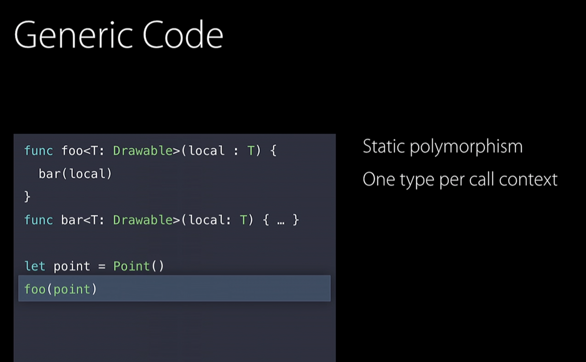 

함수 foo가 있다. 이 함수는 Drawable 제약 조건을 가진 T라는 Generic 매개변수를 통해 해당 매개변수를 함수 bar에 전달한다. 이 bar 함수는 다시 Generic 매개변수 T를 사용한다. 그런 다음 우리는 point를 만들고 이를 foo 함수에 전달한다.  

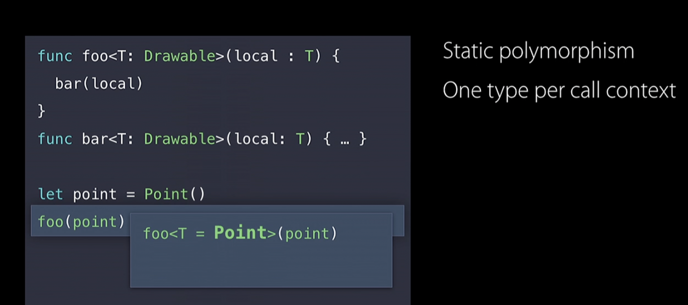  

이 함수가 실행되면 Swift는 Generic 타입 T를 이 호출 측에서 사용되는 타입(이 경우에는 Point)에 바인딩한다.
함수 foo가 이 바인딩으로 실행되고 bar의 함수에 도달하면 이 로컬 변수는 방금 찾은 타입, 즉 Point를 가진다.
 
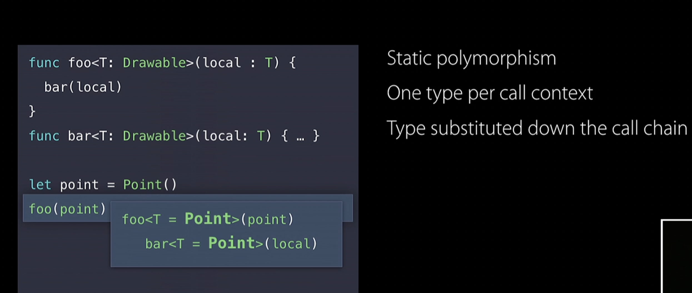  

따라서 다시 이 호출 컨텍스트의 Generic 매개변수 T는 Point 타입을 통해 바인딩된다. 보다시피 타입은 매개변수를 따라 호출 체인 아래로 대체된다. 이것이 보다 정적인 형태의 다형성 또는 매개변수 다형성을 의미한다.  
  
이제 Swift가 내부적으로 이것을 구현하는 방법을 살펴보자.

  

다시 drawACopy 함수로 돌아가보자. 이 예시에서는 Point를 전달한다. 그리고 이 공유 구현은 이전에 프로토콜 타입에 대해 했던 것과 코드와 매우 비슷해 보일 것이다.  

일반적으로 해당 기능 내부의 작업을 수행하기 위해 protocol 및 value witness table을 사용한다. 그러나 호출 컨텍스트당 하나의 타입만 있기 때문에 Swift는 여기에서 existential container를 사용하지 않는다.

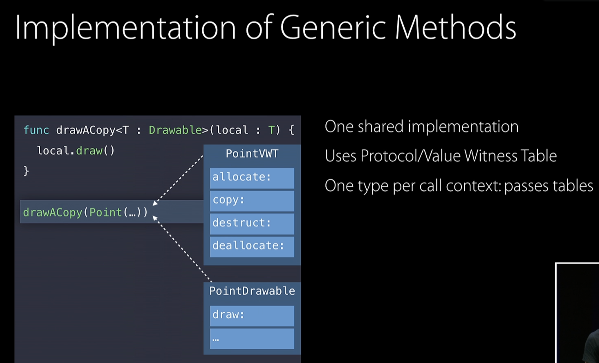  

대신, 함수에 대한 추가 인자로 이 호출에서 사용되는 타입 Point의 value witness table과 protocol witness table을 모두 전달할 수 있다. 따라서 이 경우 Line 및 Point에 대한 value witness table이 전달되었음을 알 수 있다.

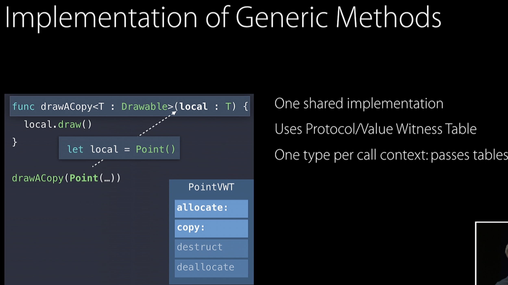 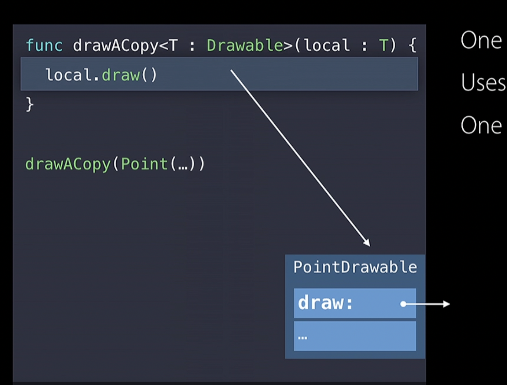 

그런 다음 해당 함수를 실행하는 동안, 매개변수에 대한 로컬 변수를 만들 때 Swift는 value witness table을 사용하여 잠재적으로 힙에 필요한 버퍼를 할당하고 할당 소스에서 대상으로 복사를 실행한다.

로컬 매개변수에 대해 draw 메서드를 실행할 때도 마찬가지로, 전달된 protocol witness table을 사용하고 테이블에서 고정 오프셋의 draw 메서드를 찾아 구현으로 이동한다. 여기에는 existential container가 없다고 말했다.  

그렇다면 Swift는 이 로컬 매개변수에 필요한 메모리를 어떻게 할당할까?   
스택에 valueBuffer를 할당한다. 다시 말하지만, 이 valueBuffer는 3단어이다.
 

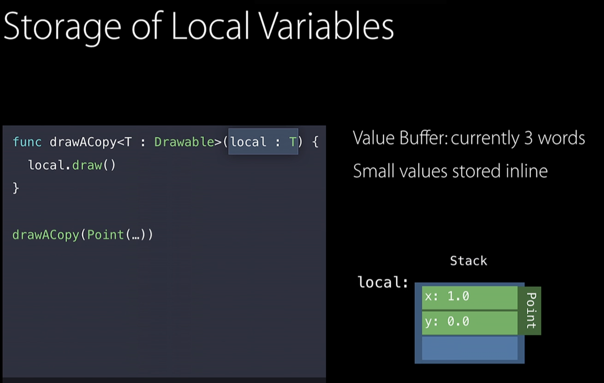 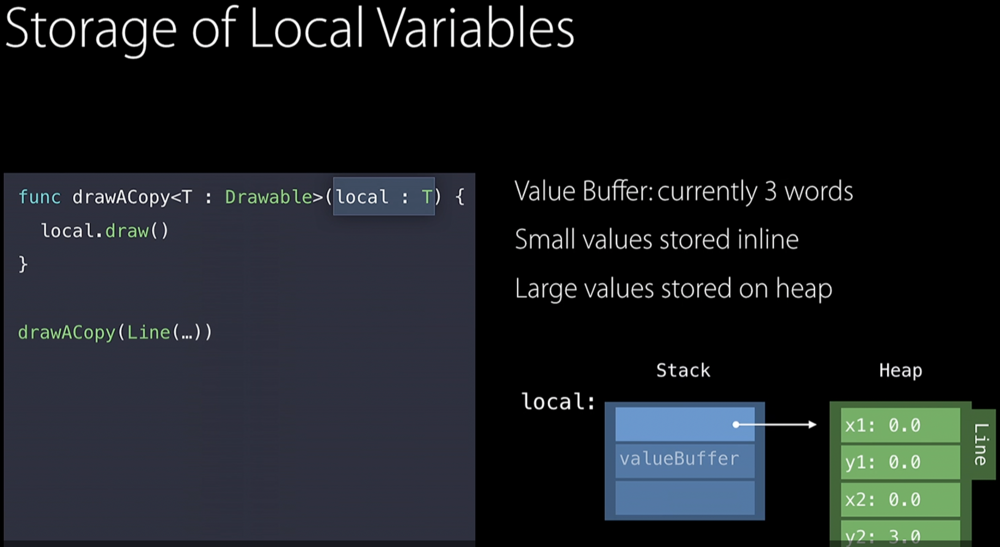 

Point와 같은 작은 값은 valueBuffer에 맞다. Line과 같은 큰 값은 다시 힙에 저장되고 local existential container 내부에 해당 메모리에 대한 포인터를 저장한다.  그리고 이 모든 것은 value witness table의 사용을 위해 관리된다.

이제 우리는 이게 더 빠른가요? 이게 더 좋은가요? 여기에서 프로토콜 타입을 사용하지 않았을 수 있었을까요? 라고 물을 수 있다.  
이 정적 형태의 다형성은 제네릭의 특수화라고 하는 컴파일러 최적화를 가능하게 한다.

## 후반부 결론  
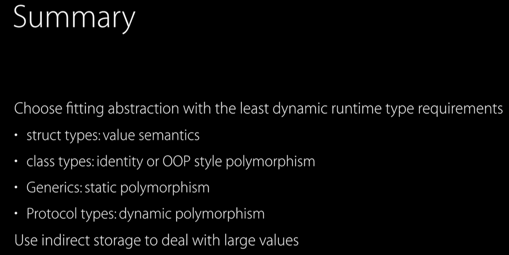 

* 동적 런타임 타입 요구 사항이 가장 적은 응용 프로그램의 엔티티에 적합한 추상화를 선택하라.  
 이렇게하면 정적 유형 검사가 활성화되고 컴파일러는 컴파일 타임에 프로그램이 올바른지 확인할 수 있으며, 추가로 컴파일러는 코드를 최적화하기 위해 더 많은 정보를 가지므로 더 빠른 코드를 얻을 수 있다.
* 구조체 및 열거형과 같은 값 타입을 이용하여 프로그램의 엔티티를 표현할 수 있는 경우 value semantic 체계를 얻을 수 있다.  
 이는 의도하지 않은 상태 공유를 막을 수 있으며 고도로 최적화 가능한 코드를 얻을 수 있다.
* 엔티티가 필요하거나 객체 지향 프레임워크로 작업을 해야해서 클래스를 사용하는 경우, 전반부에서 참조 카운팅 비율을 줄이는 기술들에 대해 이야기 했다.
* 보다 정적인 형태의 다형성을 사용하여 프로그램의 일부를 표현할 수 있는 경우, Generic 코드를 값 타입과 결합할 수 있으며 매우 빠른 코드를 얻을 수 있고 해당 코드에 대한 구현을 공유할 수 있다.
* 동적 다형성이 필요한 경우 프로토콜 타입을 값 타입과 결합하여 얻을 수 있다. 이는 클래스를 사용하는 것보다 비교적 빠른 코드를 얻을 수 있으며 value semantic을 유지할 수 있다.
* 프로토콜 타입 또는 Generic 타입 내에서 큰 값을 복사해야해서 힙 할당에 문제가 발생하는 경우, Copy on Write와 간접 저장을 사용하여 이 문제를 해결하는 방법이 있다.